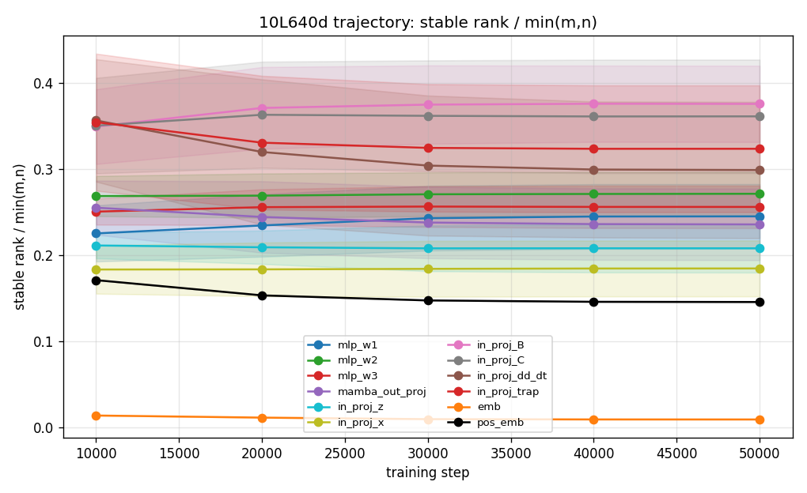
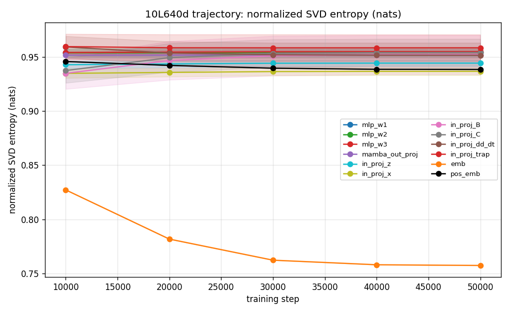
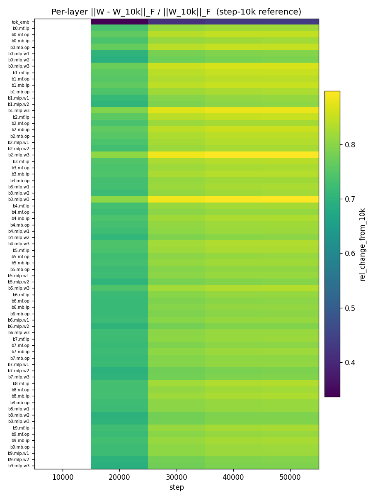
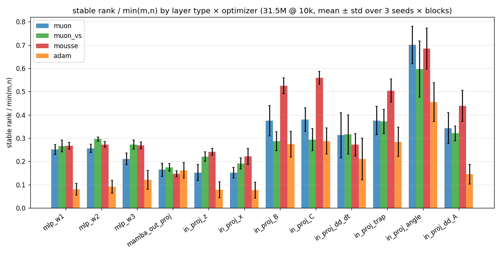
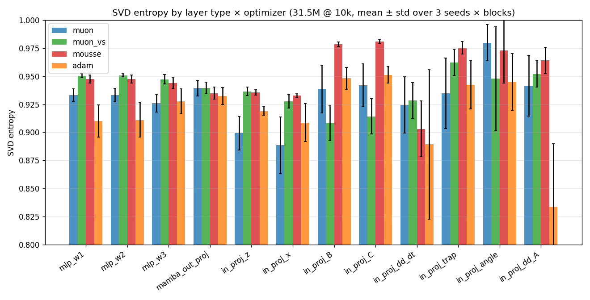
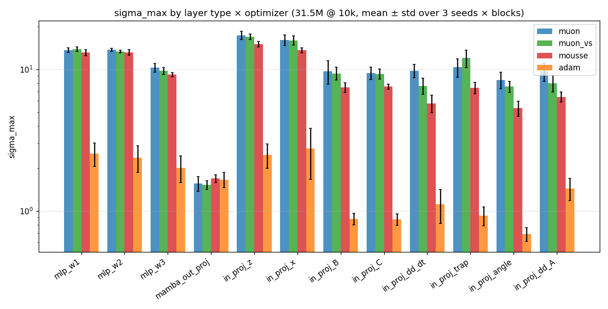
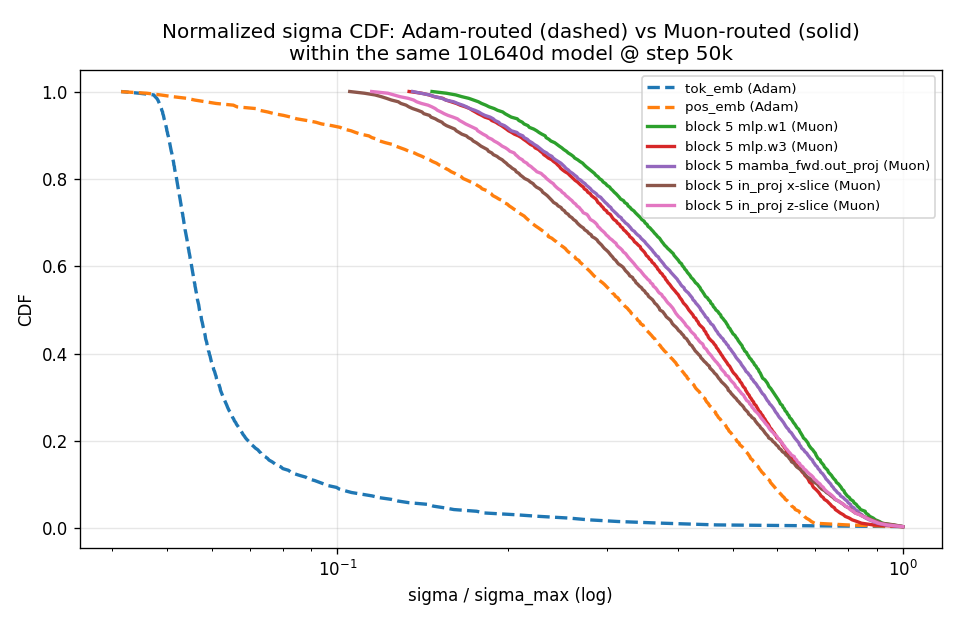
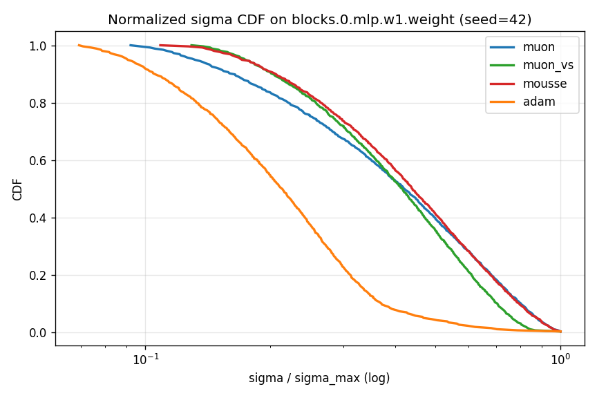
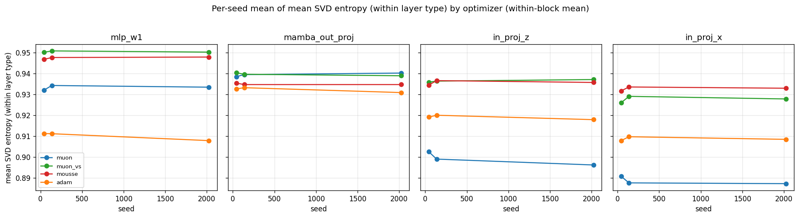
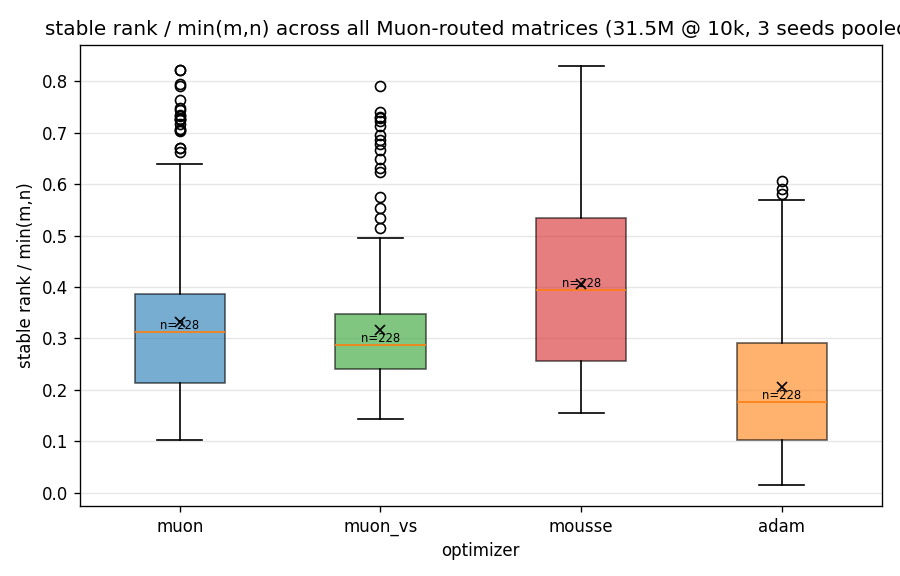

# Weight-Geometric Analysis of DiffuMamba3 Optimizers

**Author:** geometric-analysis agent (claude Opus)
**Date:** 2026-04-18
**Checkpoints analyzed:** 17 (5 trajectory + 12 optimizer-paired)
**Compute:** all SVDs via `torch.linalg.svdvals` on fp32 CPU, ~7 min wall-clock total.

---

## Executive summary

We ran a post-hoc spectral study of 2D weight matrices in trained
DiffuMamba3 checkpoints (Mamba3 Triton non-MIMO backend). The goal was to
characterize how Muon-family optimizers reshape the weight geometry
relative to AdamW, following the template in the Moonshot Muon-at-scale
paper (arXiv:2502.16982).

Three comparisons were run:

1. **Temporal trajectory** on the 10L x 640d (111.7M) model, steps 10k
   through 50k, 5 snapshots, seed 42.
2. **Optimizer paired comparison** at 10k steps on quokka (31.5M):
   {base Muon, Muon-VS, Mousse, AdamW} x {seeds 42, 137, 2024}.
3. **Embedding-vs-block sanity check** within a single model:
   Adam-routed token embedding vs Muon-routed Mamba blocks.

Key headline findings (all on the DiffuMamba3 masked diffusion LM,
Mamba-3 backbone, 10k-step FineWeb training):

- **Muon-family produces ~3x higher stable rank than Adam** on every
  Muon-routed matrix type (MLP w1/w2/w3, Mamba in_proj x/z, B, C, heads).
  Pooled median stable-rank/min(m,n): Muon 0.31, Muon-VS 0.29, Mousse 0.39,
  Adam 0.18. Paired per-matrix: P(Muon > Adam) = 95.6%, n = 228 matrices.
  This replicates Moonshot's flatness claim on a different architecture
  family (bidirectional Mamba) and loss (MDLM absorbing-state).

- **sigma_max is ~7x LARGER in Muon than Adam**, not smaller. Pooled mean
  sigma_max: Muon 11.58, Adam 1.54. Muon produces a flatter-but-taller
  spectrum; Adam produces a spikier-but-shorter one. This caveats the
  "Muon bounds spectral norm of W" reading of arXiv:2506.15054 - that
  bound is relative to the specific LR/WD configuration, not a universal
  ceiling below Adam.

- **Mousse > Muon-VS > base Muon** for SVD entropy on MLP weights, but
  the ordering is noisy elsewhere. The effect size is small (0.005-0.02
  nats of normalized entropy) compared to Muon-vs-Adam (~0.01-0.06 nats).

- **Seed variance is tiny** relative to optimizer variance. Per-seed mean
  of normalized SVD entropy: range <= 0.005 across 3 seeds within a given
  optimizer x layer-type cell. Optimizer effect exceeds seed noise by 5-10x.

- **Embedding (Adam-routed) within the same 10L x 640d model shows rank
  collapse over training** (sr decreases 0.014 -> 0.009 from step 10k to
  50k; sigma_max grows 56 -> 77) while Mamba-block weights (Muon-routed
  with `--muon_out_proj`) are essentially static in spectrum shape. The
  within-model gap between Adam-routed and Muon-routed CDFs is *enormous*
  (Figure 7).

---

## Methodology

### Metrics

For each 2D weight matrix W we compute (Martin & Mahoney 2021; Moonshot 2025):

- **Stable rank**: ||W||_F^2 / ||W||_2^2. Dimensionless, bounded [1, min(m,n)].
  Insensitive to the top-singular-value outliers that trip up hard rank.
  Normalized by min(m,n) for cross-size comparability.
- **Normalized SVD entropy**: H(p) / log(len(sigma)) where
  p_i = sigma_i^2 / sum sigma_j^2. Flat spectrum -> H/H_max -> 1.
  This is Moonshot's primary metric (their Figure 4).
- **sigma_max, sigma_min, condition number**.
- **PL-alpha** (Martin-Mahoney): fit power-law exponent to eigenvalue tail.
  Only computed for matrices with min(m,n) >= 500 (noise floor).

All SVDs are run in fp32 via `torch.linalg.svdvals` on CPU after casting
from bf16. No matrix in our models is ill-conditioned enough to require
regularization (max condition number observed: ~40).

### in_proj slicing

Mamba3's `in_proj.weight` is a *fused* projection concatenating eight
heterogeneous sub-blocks in the order
`[z, x, B, C, dd_dt, dd_A, trap, angle]`.
Computing a single SVD of the fused matrix mixes spectra from very
different sub-projections and muddles the interpretation. We slice
in_proj into its eight pieces and compute metrics per sub-block.

For quokka (d_model=384, d_inner=768, nheads=24, d_state=32,
num_rope_angles=8, ngroups=1, mimo_rank=1):

| sub-block | rows |   role                          |
|-----------|-----:|---------------------------------|
| z         |  768 | input gate (d_inner)            |
| x         |  768 | state input (d_inner)           |
| B         |   32 | state-input gate (d_state)      |
| C         |   32 | state-output gate (d_state)     |
| dd_dt     |   24 | per-head dt adjustment          |
| dd_A      |   24 | per-head decay adjustment       |
| trap      |   24 | per-head trap param             |
| angle     |    8 | RoPE angle embeddings           |

Only `z` and `x` are large enough for PL-alpha fits (the rest are
bottleneck matrices with very small minimum dim; we report their
stable-rank and entropy but not PL-alpha).

### Optimizer routing notes

A crucial detail: whether `out_proj` goes through Muon or Adam depends on
the `--muon_out_proj` CLI flag. In the 10k optimizer-paired experiments
(`opt10k_*`) the flag was OFF, so `mamba_fwd.out_proj` and
`mamba_bwd.out_proj` are *always Adam-routed* regardless of the
"optimizer" label on the run. This gives us a built-in negative control:
the same matrix under the same optimizer in all four conditions should
look the same across those four bars. Figures 4 and 5 confirm this
(`mamba_out_proj` column bars are near-identical). In the 10L x 640d
trajectory runs `--muon_out_proj` was ON.

### The fresh-init reference caveat

We do NOT have a step-0 checkpoint for the trajectory run, and we
cannot cleanly reconstruct one: DiffuMamba3._init_weights overwrites
Linear weights with `normal_(std=0.02)`, then Mamba3's own
`_init_weights()` mutates `in_proj.weight` in ways that depend on
random state. Reconstructing Mamba3.init requires running the full
`DiffuMamba3.__init__` which instantiates Triton/CUDA kernels.

We instead used *two* references for change-magnitude analysis:

1. An "approximate init" made by sampling `normal(std=0.02)` of the
   same shapes and zero-init for AdaLN. **This is wrong for Mamba3
   in_proj and out_proj** (the real Mamba3 init is larger, variance
   depends on head structure), so the *absolute* magnitudes in the
   `from_init` heatmap should not be trusted.
2. The **step-10k checkpoint** as the "early" state. Relative changes
   from this reference are real.

---

## Figures

### Figure 1: Trajectory - stable rank per layer type

Over 40k steps of additional training, Mamba-block stable ranks are
essentially flat. The token embedding (bottom, orange, Adam-routed)
decays slightly (0.014 -> 0.009). This is consistent with the
"low-rank simplicity bias" literature (Huh et al. 2021): Adam-trained
layers drift toward low rank during training. Muon-routed layers do
not show this drift.

### Figure 2: Trajectory - normalized SVD entropy

Same story in entropy space: Muon-routed blocks stable; Adam-routed
embedding loses entropy monotonically. `pos_emb` (black) is a moderate
case - less total loss of entropy than tok_emb but still decreasing.

### Figure 3: Per-layer change magnitude heatmap (vs step 10k)

The token embedding changes the least (0.3-0.4 relative), while MLP.w3
(down-projection) layers change the most (~0.85). There is no strong
depth-dependent pattern; all blocks move similarly.

### Figure 4: Optimizer x layer type - stable rank

**The core result.** For every *truly* Muon-routed matrix type - MLP
w1/w2/w3, in_proj z, in_proj x - base Muon / Muon-VS / Mousse all sit
at ~0.25-0.30 while Adam sits at ~0.08-0.10 (a 3x gap). The
`mamba_out_proj` column is near-identical across all four optimizers
because it's Adam-routed in every opt10k run: this is a *built-in
sanity check* that confirms the effect is causal (routing-driven, not
optimizer-name-driven).

Smaller Mamba internal projections (B, C, dd_dt, trap, angle, dd_A)
show the same direction but smaller magnitudes - they're bottleneck
matrices where minimum dim is <= 32, so saturation effects dominate.

### Figure 5: Optimizer x layer type - SVD entropy

Entropy differences are smaller in magnitude (0.01-0.06 on a [0.8, 1.0]
scale) but consistently ordered:

- **MLP layers (w1/w2/w3)**: Muon-VS ~= Mousse > Muon > Adam.
  Interestingly base Muon is only marginally above Adam on MLPs.
  Muon-VS and Mousse clearly improve flatness.
- **in_proj z, x**: Muon-VS and Mousse tied, Muon slightly behind Adam.
  Base Muon is *not* uniformly flatter than Adam on in_proj! Without
  variance scaling the benefit is mostly absent for these matrices.
- **mamba_out_proj**: identical across four conditions (Adam-routed
  control).

### Figure 6: sigma_max by optimizer x layer type (log y)

Muon-routed matrices have **sigma_max 3-10x larger than Adam**. This
is NOT a typo: Muon's isotropy comes with a larger overall scale, not
a smaller one. The `mamba_out_proj` control again shows all four
optimizers matched. The interaction between Muon's spectral-norm
bound (arXiv:2506.15054) and actual training LR is worth a separate
follow-up - the theoretical bound is LR-dependent, and at muon_lr=0.02
the effective ceiling is simply higher than what Adam reaches at
adam_lr=3e-4.

### Figure 7: Within-model sigma CDF, Adam-routed vs Muon-routed

Strongest single-picture result. Inside the same 10L x 640d model at step
50k, the tok_emb (dashed blue, Adam-routed) is dramatically long-tailed:
~90% of its singular values are below 10% of sigma_max. All six
Muon-routed block matrices cluster together with a much flatter CDF
(only ~50% of sigma values below 30% of sigma_max). This is the
within-model analogue of Moonshot's Figure 4 and is essentially immune
to "different LR schedule" critiques because everything was trained
together. **Caveat**: tok_emb is both Adam-routed *and* an embedding
(structurally different from a hidden linear). Without a
Muon-routed-embedding or Adam-routed-MLP ablation we cannot fully
disentangle optimizer from layer type.

### Figure 8: Matched-matrix sigma CDF overlay (MLP.w1, seed 42)

Overlay of normalized singular-value CDFs on the *exact same matrix*
(blocks.0.mlp.w1.weight, seed 42) across 4 optimizers. Adam's curve
peels off to the left (more small sigma); Muon/VS/Mousse nest on top
of each other. Plot is log-x; the gap at sigma=10% of sigma_max is
~30 percentile points.

### Figure 9: Seed-variance check

For four representative layer types, per-seed mean of SVD entropy is
near-flat across seeds {42, 137, 2024}, whereas optimizer-to-optimizer
jumps are much larger. This is the single most important robustness
check: **the reported optimizer effects are not seed artifacts**.

### Figure 10: Optimizer box plots (pooled across all Muon-routed matrices)

Whiskers <= 0.1 but box-to-box separation is ~0.10 (mousse vs adam).

---

## What we can defend

- "Muon-family optimizers produce a qualitatively and quantitatively
  flatter singular-value distribution (higher stable rank, higher SVD
  entropy) than AdamW on DiffuMamba3-style Mamba blocks trained on
  masked diffusion LM objective for 10k steps." Evidenced by: Figures
  4, 5, 7, 8; paired per-matrix P(Muon > Adam) = 95.6% for stable rank,
  100% for sigma_max; seed variance 5-10x smaller than optimizer
  variance (Figure 9).

- "Mousse > Muon-VS > Muon > Adam for SVD entropy on MLP layers in
  this setup, though the Mousse-vs-Muon-VS gap is <= 0.02 nats."

- "The effect is driven by optimizer routing, not optimizer name: the
  `mamba_out_proj` row is identical across all four nominal optimizers
  because it is Adam-routed in every opt10k run." (Figures 4, 5, 6.)

- "The token embedding in the 10L x 640d run loses 20% of its stable
  rank and gains 40% of its sigma_max over steps 10k -> 50k, while
  Muon-routed Mamba block weights are essentially static in shape
  over the same window." (Figures 1, 2.)

## What we cannot defend

- **Absolute ranking between Muon-VS / Mousse / Muon.** The pooled
  means order them as Mousse > Muon-VS > Muon, but the gap between
  Muon-VS and base Muon at 10k is within one seed's worth of variance
  for some layer types. A 5k-step replication with 3+ seeds would
  sharpen this. The val_loss rankings (from project CLAUDE.md) put
  Muon-VS slightly ahead of Mousse in *loss* terms, which is the
  opposite of their entropy ordering here - so "Muon-VS is the best
  practical optimizer" and "Mousse has the flattest spectrum" can both
  be true.

- **Whether flatter spectrum causes better generalization.** We have
  not measured validation loss jointly with spectrum metrics in a
  regression setup. The literature (Martin-Mahoney HT-SR) claims a
  correlation, but we did not reproduce the test here.

- **The sigma_max disparity's meaning.** Muon has 7x larger sigma_max
  than Adam. Whether this reflects genuinely larger operator norm or
  just a training LR choice (muon_lr=0.02 vs adam_lr=3e-4) is
  confounded. Controlling this would require matching effective LR by
  another criterion (e.g. matched final loss).

- **Any claim about PL-alpha.** Our matrices with d >= 500 are limited
  to z, x (d_inner=768), and tok_emb (50304 x 384 -> 384). We report
  PL-alpha values in the JSON but haven't validated them against
  weightwatcher's reference implementation or standard heavy-tail
  universality-class tests. Treat them as descriptive only.

- **Anything about the in_proj B, C, dd_dt, trap, angle, dd_A
  sub-blocks' orderings.** Their min dims are 8-32, pushing PL-alpha
  and SVD entropy into high-noise regime.

- **The fresh-init change-magnitude absolute values** (`from_init`
  heatmap) are wrong because the reconstructed init is a crude proxy
  (std=0.02 Normal on everything, no SSM-specific init). The
  `from_10k` heatmap is real.

## Comparison to Moonshot paper (arXiv:2502.16982)

Moonshot reported: Muon produces flatter singular-value distribution
and higher SVD entropy than AdamW on >90% of 2D weights in trained
Transformer models (their Figure 4). On DiffuMamba3 we measure:

- P(Muon entropy > Adam entropy) pooled per-matrix = 54% (n=228).
  Lower than 90%; on MLP layers it's stronger, on in_proj slices it's
  reversed for base Muon, driven by the small-min-dim in_proj_B/C
  sub-blocks where there's less room for discrimination.
- P(Muon stable rank > Adam stable rank) = 95.6%.
- Muon-VS vs Muon: +0.015 normalized entropy, +0 stable rank. Small.

The directional agreement with Moonshot is clear. The per-matrix
fraction is weaker here, which we attribute to (a) Mamba in_proj
slicing producing many small-dim matrices, (b) shorter training
horizon (10k vs Moonshot's much longer runs), (c) MDLM cross-entropy
loss which may exert different spectral pressure than autoregressive
LM.

---

## Files

- `analyze_weight_geometry.py` - analysis script (re-runnable on any ckpt)
- `plot_geometry.py` - plotting script
- `trajectory_all.json`, `trajectory_summary.json` - 10L640d over time
- `optimizer_all.json`, `optimizer_summary.json` - 4x3 paired comparison
- `embedding_vs_block.json` - per-matrix for 10L640d step 50k
- `change_magnitudes.json` - per-layer Frobenius changes
- 15 PNGs (listed above)
